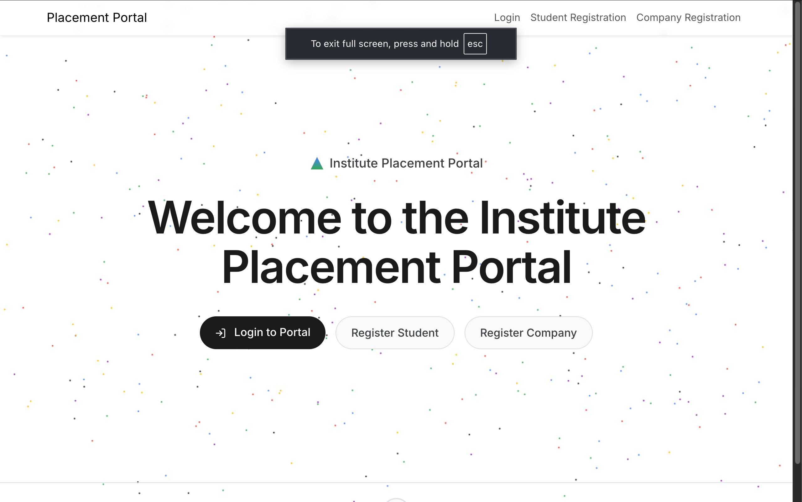
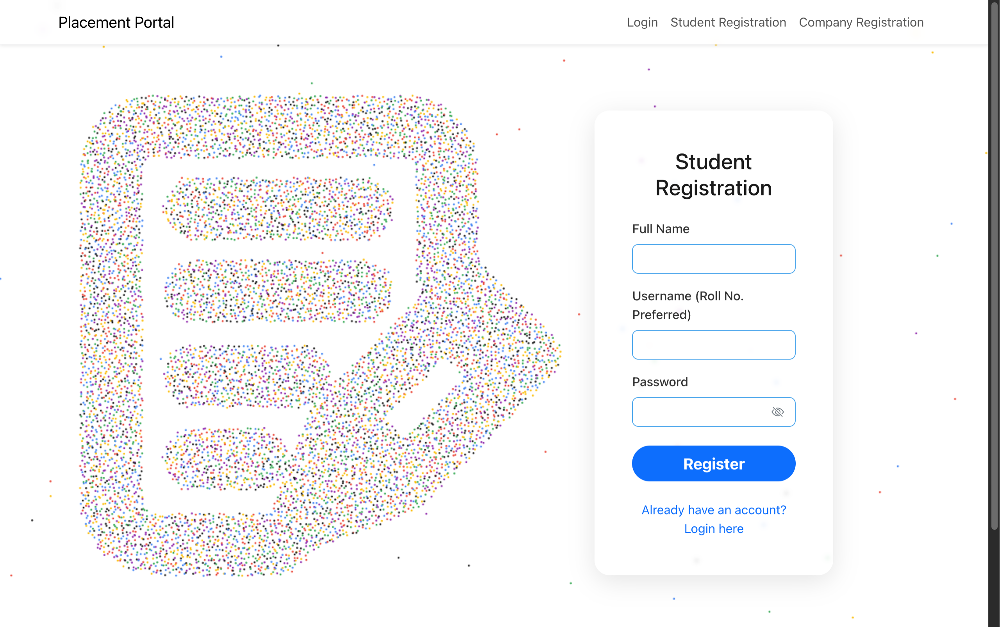
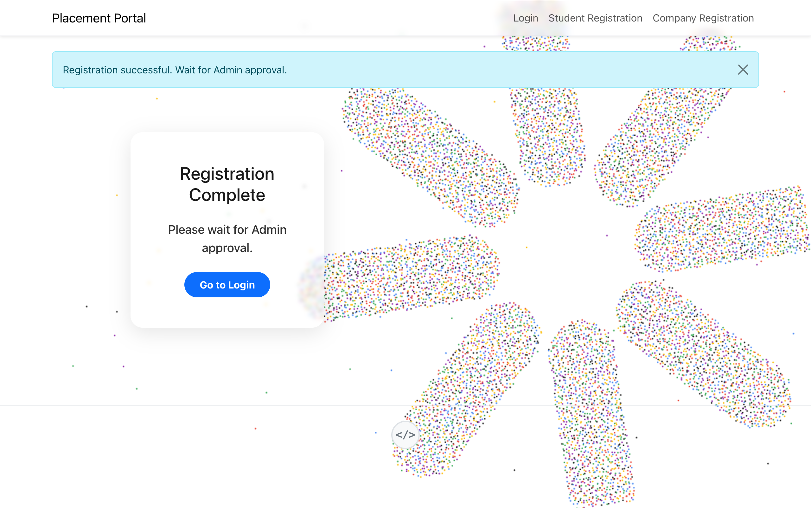

# 🎓 Campus Placement Management System

A comprehensive web application designed to streamline the campus placement process. This platform connects students, companies, and administrators in a single ecosystem to manage job drives, applications, and student profiles efficiently.

---

## 🚀 Key Webpages & Features

### 1. Home Page
The landing page provides an overview of the platform, highlighting the benefits for students and companies. It features a modern, interactive design with particle animations and clear calls to action for logging in or registering.



*   **Purpose:** Introduction to the platform and navigation hub.
*   **Features:** Quick links to login/register, interactive background, and role-based entry points.

### 2. Login Page
A secure entry point for all users (Admin, Company, Student).


*   **Purpose:** Authenticate users based on their roles.
*   **Features:** Role-based redirection, error handling for invalid credentials, and links to registration pages.

### 3. Registration Page
Separate registration flows for Students and Companies.



*   **Purpose:** Allow new users to join the platform.
*   **Features:** Form validation, password hashing, and specialized fields (e.g., Company Name vs Student Name).
*   **Note:** Company registrations are marked as 'Pending' until approved by an Admin.

### 4. Approval Page (Admin Control)
A dedicated interface for administrators to manage new company registrations and job drive requests.



*   **Purpose:** Maintain platform quality and security by vetting companies and drives.
*   **Features:** Approve, Reject, or Blacklist companies; approve or reject job drive postings.

### 5. Admin Dashboard
The central command center for platform administrators.


*   **Purpose:** High-level overview and management of the entire placement ecosystem.
*   **Features:**
    *   **Statistics:** Total Students, Companies, Drives, and Applications.
    *   **User Management:** Search and manage students and companies.
    *   **Drive Management:** Overview of all active, pending, and closed drives.

---

## 🛠️ Role-Based Features

### 👨‍💼 Administrator
- **User Management:** Approve new company registrations, blacklist suspicious accounts.
- **Drive Oversight:** Review and approve job drives created by companies.
- **Data Visualization:** Real-time stats on placement activity.
- **Search:** Quickly find users using the search functionality.

### 🏢 Company
- **Profile Management:** Maintain company details.
- **Job Drives:** Create and manage placement drives (Job Title, Description, Eligibility, Deadline).
- **Applicant Tracking:** View students who applied, download resumes, and update application status (Shortlisted, Selected, Rejected).

### 🎓 Student
- **Profile Building:** Update personal details and upload a professional resume.
- **Job Discovery:** Browse and search for approved placement drives.
- **Easy Application:** Apply to job drives with a single click.
- **History:** Track application status and history.

---

## ⚙️ Installation & Setup

1.  **Clone the Repository:**
    ```bash
    git clone <repository-url>
    cd "iitm mad1 project clone"
    ```

2.  **Environment Configuration:**
    Create a `.env` file in the root directory (already provided in this version):
    ```env
    ADMIN_USERNAME=admin
    ADMIN_PASSWORD=admin
    ADMIN2_USERNAME=admin2
    ADMIN2_PASSWORD=admin2
    SECRET_KEY=your_secret_key
    ```

3.  **Install Dependencies:**
    ```bash
    pip install -r requirements.txt
    ```

4.  **Run the App:**
    ```bash
    python app.py
    ```
    The app will be available at `http://127.0.0.1:5000`.

---

## 🔒 Security
- **Passwords:** All passwords are hashed using `pbkdf2:sha256`.
- **Environment Variables:** Sensitive data like Admin credentials and Secret Keys are stored in `.env`.
- **Access Control:** Role-based access control (RBAC) ensures users only see what they are authorized to.

---

## 🚀 Deployment (Vercel)

If you are deploying this application to **Vercel**, you must manually add the environment variables in the Vercel Dashboard, as your local `.env` file is not uploaded for security reasons.

### Steps to add Environment Variables on Vercel:
1.  Go to your project on the [Vercel Dashboard](https://vercel.com/dashboard).
2.  Navigate to **Settings** > **Environment Variables**.
3.  Add the following keys and their corresponding values:
    -   `ADMIN_USERNAME`
    -   `ADMIN_PASSWORD`
    -   `ADMIN2_USERNAME`
    -   `ADMIN2_PASSWORD`
    -   `SECRET_KEY` (Generate a random string for production)
4.  Redeploy your application for the changes to take effect.

---

## 📜 License
This project is licensed under the MIT License.
